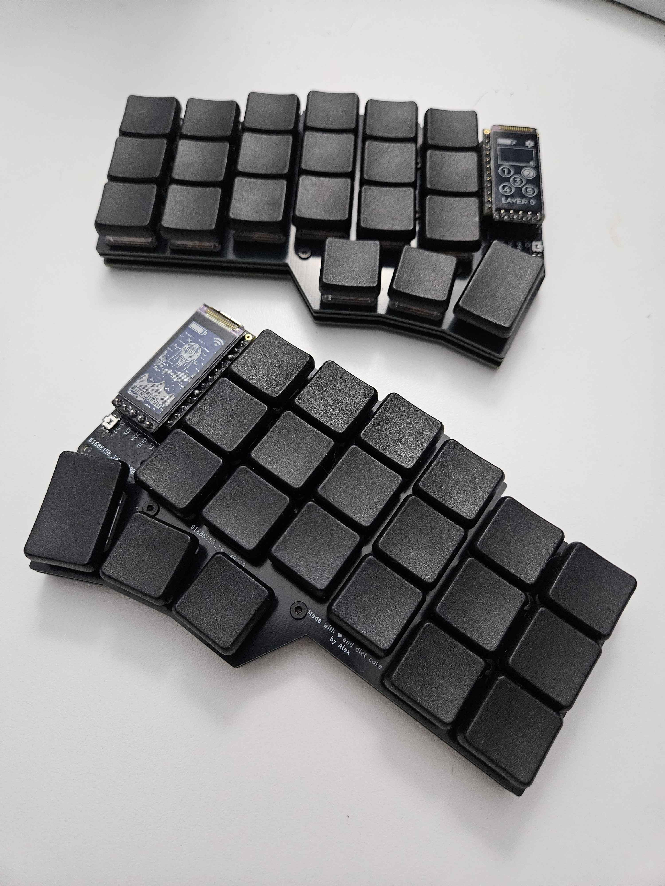

# choc-spaced-corne
Choc spaced corne based on klouderone's [cornev4promicroedition](https://github.com/klouderone/cornev4promicroedition)

Does not feature hotswap and TRRS plugs.

Pinouts are the same as the classic corne, so the firmware setup is as simple as choosing corne in [zmk setup](https://zmk.dev/docs/user-setup).

## Images

